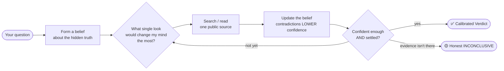

<div align="center">

# 🔭 Aletheia — *The Uncertainty Loop*

**An AI investigator that knows what it doesn't know — and proves it.**

🪄 *Made with Claude Fable*


-blue)


</div>

---

Most AI "research" assistants do the same thing: run a few searches, then summarize whatever
came back loudest. They sound the most confident exactly when they're most wrong.

**Aletheia is built the opposite way.** Ask it whether something is *actually true* — *"Is
this vendor really at $10M ARR?"*, *"Is this company financially healthy, or just loud?"* —
and it treats the answer as a **hidden truth** and every search result as a **noisy clue**.
It holds an explicit belief about what's likely true, spends each search where it will
*reduce its own uncertainty the most*, lets contradicting evidence **lower** its confidence,
and stops only when the evidence has earned an answer — or says **INCONCLUSIVE** when it
hasn't.

You get back a **Verdict**: a bottom-line call, a plain-English confidence for each claim,
the evidence with sources, and the residual unknowns it couldn't resolve.

```text
VERDICT — Acme "$10M ARR / 10,000 paying customers"
- Bottom line: the claim looks OVERSTATED.        Confidence: HIGH (~90%)
- What we found:
    · Customer traction appears inflated          — high confidence (~90%)
    · Funding / runway looks strained             — moderate confidence (~75%)
- Evidence:
    1. Third-party review counts are low and growing slowly.
    2. Headcount and hiring cut the other way — a conflicting signal we weighed, not ignored.
    3. Only a small seed round on record — hard to square with the ARR claim.
- Residual unknowns: the true paying-customer count (not public).
- Want more certainty? We can pull hiring/layoff filings and pricing history.
```

> Notice what it *didn't* do: it didn't hide the signal that cut against its conclusion, and
> it didn't round its uncertainty up to a clean 100%. That restraint is the whole point.

---

## The Uncertainty Loop 🔁 — the interesting part

A typical agent loop is *think → act → repeat*, and it guesses. Aletheia runs a
**`belief → act → observe → update`** loop — the shape of a **POMDP** (a decision process
where the true state is *partially observable*). The value of that shape is that it
**separates gathering information from committing to an answer**, and it always knows how
much it doesn't yet know.



Three engineering choices make it more than a diagram:

- **It searches by *value of information*, not breadth.** Each next look is the one most
  likely to move the answer, at the least cost — so it needs fewer searches, not more.
- **It stops on *two* conditions, never one.** A single lucky strong result clears the
  confidence bar but not the *uncertainty* bar, so the loop keeps looking rather than
  committing on one observation. (In live runs this both *rescued* a claim and *confirmed* a
  debunk — same mechanism, opposite outcomes.)
- **It holds one judgment per question, in parallel, with no bleed.** "Well-funded" and
  "honest about traction" are separate unknowns — so it can conclude *genuinely well-backed
  **and** overstating its numbers* about the same company, which is exactly the call that
  investor-halo reasoning misses.

And a first-class outcome most agents lack: a trustworthy **"I don't know."** INCONCLUSIVE is
a real answer here, not an error — which is what makes the confident answers worth trusting.

## 🌐 Point it at anything uncertain

Companies are the shipped example, not the limit. The machinery — *investigate a hidden
truth through noisy public clues, weigh conflicting evidence, refuse to over-claim* — is
domain-neutral. To re-aim it you change only **who it is** (a few lines of identity) and its
**evidence map** (which questions it tracks and which sources it trusts); the safety rules
and the uncertainty instincts stay put.

- 🏗️ **Vet a home-renovation contractor** — are the claimed license, insurance, and track
  record real? (license registries and court records outweigh a glossy portfolio)
- 🔬 **Triage a viral science headline** — does the claim match what the study actually
  measured? (the paper and retraction databases outweigh the press release)
- 🏢 **Diligence a vendor or competitor** — is the traction, funding, or momentum real?

Same habits, different domain: *headline vs. what was actually measured*, *one loud story
vs. the weight of evidence*, and an honest *"real, but overstated"* when that's the truth.

## 🎛️ It tunes itself (safely)

Aletheia sharpens from your own usage. Each investigation privately logs how informative
each *kind* of evidence turned out to be; after enough runs, a **guarded, offline cycle**
re-weighs how much trust each source type deserves — statistically, from real outcomes.

The guardrails are the feature:

- Every proposed change is **replayed against your past investigations** to prove it
  wouldn't have made any of them worse, and the full test suite must pass, **before a single
  number changes**.
- A hard invariant: tuning may make Aletheia *cheaper, more consistent, or better
  calibrated* — **never more confident**. A change whose only effect is "sound surer" is
  auto-rejected.
- Changes are tiny by design, logged to a human-readable ledger, and **everything stays on
  your machine**. Run it by hand, or make it hands-free with a one-time hook. *(→ User Guide.)*

---

## 🚀 Get started

Aletheia is **100% local** — a file copy, nothing published or uploaded. It runs today on:

| Harness | Status |
|---|---|
| **Claude Code** (desktop app or CLI) | ✅ Supported |
| **OpenAI Codex** | ✅ Supported |
| **Claude Cowork** | 🚧 Work in progress |

**Setup — including install, first run, query patterns, re-domaining, and self-tuning — is in
the → [User Guide](USER-GUIDE.md).** The 60-second version:

- **Claude Code:** copy `.claude/skills/aletheia/` into `~/.claude/skills/`, open a new chat,
  and ask a plain question. It engages on intent — you never name a skill.
- **OpenAI Codex:** point Codex at the self-contained [`codex/AGENTS.md`](codex/AGENTS.md) and
  ask. Same investigator, same protections.

No dependencies required: the math helper is pure Python standard library (Python is even
optional — the agent falls back to inline arithmetic).

## 🧠 How it works under the hood

Curious how the loop, the math, and the tuning actually fit together? These go deep:

- **[POMDP-Loop Agentic Blueprint](POMDP-Loop-Agentic-Blueprint.md)** — the design and the
  research it builds on; Part 7 records what shipped vs. the original plan.
- **[Loop-engineering field guide](Aletheia-loop-engg.md)** — the loop's anatomy, every
  tunable knob, and the tuning ledger.
- **[Auto-tuner proposal](auto-tuner-workflow-proposal.md)** & **[implementation plan](statistical-recalibration-implementation-plan.md)**
  — how self-tuning stays honest (EM recalibration + deterministic replay gates).
- **[Acceptance runs](tests/scenarios.md)** & **[the 9-case adversarial battery](tests/hard-cases.md)**
  — where the loop earns its keep against traps a summarizer fails.

## 🗺️ What's in here

```text
Aletheia/
├─ AGENTS.md · CLAUDE.md          # governance (identity, the Constitution, engagement rules)
├─ .claude/skills/aletheia/       # the product: procedure, parameters, math helper, tuner
├─ codex/AGENTS.md                # self-contained OpenAI Codex build (generated)
├─ USER-GUIDE.md                  # setup + how to use, for every harness
├─ tests/                         # coprocessor math, confidentiality gate, acceptance fixtures
└─ *.md                           # design & engineering deep-dives
```

## ⚖️ What it is — and isn't

- It is a **calibrated assessment of a claim**, with evidence and stated confidence — **not**
  investment, legal, or professional advice, and never a buy/sell recommendation.
- It reads **public sources only**. It doesn't log in, bypass paywalls, or contact anyone.
- Reputationally severe claims (fraud, misconduct) are handled as **labeled hypotheses
  needing primary-source confirmation**, never asserted as fact.
- Live web results drift, so judge it on **calibration and evidence quality**, not on any
  single confidence number.

---

## 👋 Connect

Built by **Sankar**. Questions, ideas, or a good story about a decision made under
uncertainty? I'd love to hear it.

[](https://www.linkedin.com/in/nsk007/)

*If Aletheia's approach to uncertainty resonates, a ⭐ helps others find it.*

## 📚 References

- **User Guide** — [USER-GUIDE.md](USER-GUIDE.md) · setup and usage for Claude Code & Codex
- **The design** — [POMDP-Loop Agentic Blueprint](POMDP-Loop-Agentic-Blueprint.md)
- **Loop engineering & tuning** — [Aletheia-loop-engg.md](Aletheia-loop-engg.md) ·
  [auto-tuner proposal](auto-tuner-workflow-proposal.md) ·
  [recalibration plan](statistical-recalibration-implementation-plan.md)
- **Evidence** — [acceptance scenarios](tests/scenarios.md) ·
  [hard-case battery](tests/hard-cases.md)
- **OpenAI Codex build** — [codex/README.md](codex/README.md)
- The open **[AGENTS.md](https://agents.md/)** standard for cross-agent instructions

<div align="center">

*Aletheia — Greek for "truth unconcealed." 🪄 Made with Claude Fable.*

</div>
