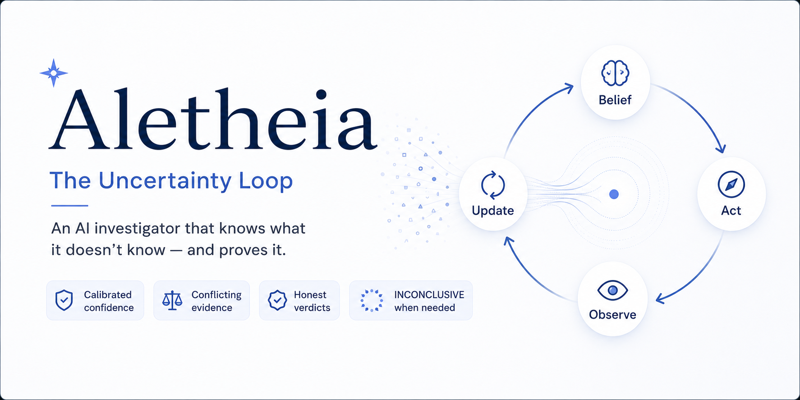
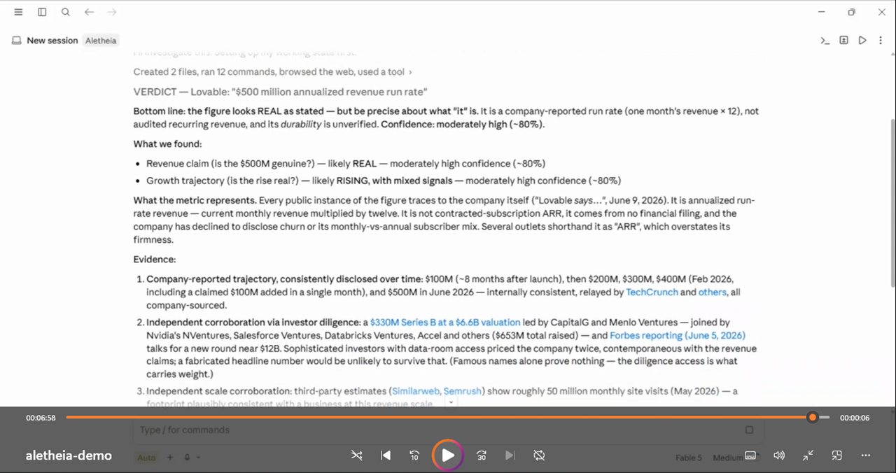

<div align="center">



# 🔭 Aletheia — *The Uncertainty Loop*

**An AI investigator that earns its confidence.**

*Built for investigations where the truth is hidden and the evidence is noisy.*


-blue)


</div>

---

Most AI "research" assistants do the same thing: run a few searches, then summarize whatever
came back loudest. They sound the most confident exactly when they're most wrong.

**Aletheia is built the opposite way.** Ask it whether something is *actually true* — *"Is
this vendor really at $10M ARR?"*, *"Is this company financially healthy, or just loud?"* —
and it treats the answer as a **hidden truth** and every search result as a **noisy clue**.
It holds an explicit belief about what's likely true, spends each search where it will
*reduce its own uncertainty the most*, lets contradicting evidence **lower** its confidence,
and stops only when the evidence has earned an answer — or says **INCONCLUSIVE** when it
hasn't.

You get back a **Verdict**: a bottom-line call, a plain-English confidence for each claim,
the evidence with sources, and the residual unknowns it couldn't resolve. Illustrative
shape (the company is fictional):

```text
VERDICT — Acme "$10M ARR / 10,000 paying customers"
- Bottom line: the claim looks OVERSTATED.        Confidence: HIGH (~90%)
- What we found:
    · Customer traction appears inflated          — high confidence (~90%)
    · Funding / runway looks strained             — moderate confidence (~75%)
- Evidence:
    1. Third-party review counts are low and growing slowly.
    2. Headcount and hiring cut the other way — a conflicting signal we weighed, not ignored.
    3. Only a small seed round on record — hard to square with the ARR claim.
- Residual unknowns: the true paying-customer count (not public).
- Want more certainty? We can pull hiring/layoff filings and pricing history.
```

> [!NOTE]
> Notice what it *didn't* do: it didn't hide the signal that cut against its conclusion, and
> it didn't round its uncertainty up to a clean 100%. That restraint is the whole point.

---

## The Uncertainty Loop 🔁 — the interesting part

A typical agent loop is *think → act → repeat*, and it guesses. Aletheia runs a
**`belief → act → observe → update`** loop — the shape of a **POMDP** (a decision process
where the true state is *partially observable*). The value of that shape is that it
**separates gathering information from committing to an answer**, and it always knows how
much it doesn't yet know.


Three engineering choices make it more than a diagram:

- **It searches by *value of information*, not breadth.** Each next look is the one most
  likely to move the answer, at the least cost — so it needs fewer searches, not more.
- **It stops on *two* conditions, never one.** A single lucky strong result clears the
  confidence bar but not the *uncertainty* bar, so the loop keeps looking rather than
  committing on one observation. (In live runs this both *rescued* a claim and *confirmed* a
  debunk — same mechanism, opposite outcomes.)
- **It holds one judgment per question, in parallel, with no bleed.** "Well-funded" and
  "honest about traction" are separate unknowns — so it can conclude *genuinely well-backed
  **and** overstating its numbers* about the same company, which is exactly the call that
  investor-halo reasoning misses.

And a first-class outcome most agents lack: a trustworthy **"I don't know."** INCONCLUSIVE is
a real answer here, not an error — which is what makes the confident answers worth trusting.

---

## 🎬 See Aletheia in Action

Watch Aletheia investigate whether Lovable’s reported revenue growth is supported by publicly available evidence—separating reported claims, corroborating signals, contradictions, and what remains independently unverifiable.

<p align="center">
  <a href="https://youtu.be/sG5V3x0nnD0">
    
  </a>
</p>

<p align="center">
  <a href="https://youtu.be/sG5V3x0nnD0"><strong>▶ Watch the demo on YouTube</strong></a>
  <sub>Tip: Ctrl/Cmd-click to open in a new tab.</sub>
</p>

> [!NOTE]
> This demo uses public information available at the time of recording. It is an evidence-based assessment using AI tools, not an allegation or investment advice.

---

## 🚀 Get started (two minutes)

Aletheia is **100% local** — a file copy, nothing published or uploaded. No dependencies:
the math helper is pure Python standard library, and even Python is optional (the agent
falls back to inline arithmetic). Local-first: the skill, traces, tuning, and audit trail remain on your machine. 
Web investigation uses your agent harness’s search capabilities.

| Harness | Status |
|---|---|
| **Claude Code** (desktop app or CLI) | ✅ Supported |
| **OpenAI Codex** | ✅ Supported |
| **Claude Cowork** | 🚧 Work in progress |

**Claude Code** — clone, copy the skill, ask:

```bash
git clone https://github.com/nsankar/Aletheia.git

# macOS / Linux
mkdir -p ~/.claude/skills && cp -r Aletheia/.claude/skills/aletheia ~/.claude/skills/aletheia
```

```bat
:: Windows
robocopy Aletheia\.claude\skills\aletheia "%USERPROFILE%\.claude\skills\aletheia" /E
```

Then open a **new chat** and ask a plain question — it engages on intent; you never invoke
anything by name. *(Or skip the copy entirely: open the cloned repo in Claude Code and ask
right there — the skill ships in-repo.)*

**OpenAI Codex** — point Codex at the self-contained [`codex/AGENTS.md`](codex/AGENTS.md)
and ask. Same investigator, same protections.

First questions to try:

> *"Acme says it has 10,000 paying customers — is that real?"*
> *"Is this vendor financially healthy enough to sign a 3-year contract with?"*
> *"Is our competitor actually growing, or just loud?"*

Full setup — install, first run, query patterns, re-domaining, and self-tuning — is in the
**[User Guide](docs/USER-GUIDE.md)**.

## 🌐 Point it at anything uncertain

Companies are the shipped example, not the limit. The machinery — *investigate a hidden
truth through noisy public clues, weigh conflicting evidence, refuse to over-claim* — is
domain-neutral. To re-aim it you change only **who it is** (a few lines of identity) and its
**evidence map** (which questions it tracks and which sources it trusts); the safety rules
and the uncertainty instincts stay put.

- 🏗️ **Vet a home-renovation contractor** — are the claimed license, insurance, and track
  record real? (license registries and court records outweigh a glossy portfolio)
- 🔬 **Triage a viral science headline** — does the claim match what the study actually
  measured? (the paper and retraction databases outweigh the press release)
- 🏢 **Diligence a vendor or competitor** — is the traction, funding, or momentum real?

Same habits, different domain: *headline vs. what was actually measured*, *one loud story
vs. the weight of evidence*, and an honest *"real, but overstated"* when that's the truth.

##🔌 Aletheia Ideas — richer evidence through MCP

Web search is only one possible sensor. Run Aletheia in Claude Code with permissioned MCP connectors, and its uncertainty loop can investigate authoritative databases, internal workspaces, live intelligence, and deal rooms—choosing the next most informative source, weighing contradictions, and returning either a calibrated verdict or an honest **INCONCLUSIVE**.

| Idea to explore                                 | Representative MCPs / connectors                                                                                                                                   | What Aletheia could investigate                                                                                                                                                                                                                                                 |
| ----------------------------------------------- | ------------------------------------------------------------------------------------------------------------------------------------------------------------------ | ------------------------------------------------------------------------------------------------------------------------------------------------------------------------------------------------------------------------------------------------------------------------------- |
| **Legal claim verification**                    | [CoCounsel Legal MCP](https://legal-mcp.thomsonreuters.com/docs/connector-guide) + [HighQ MCP](https://www.thomsonreuters.com/en-gb/help/highq/highq-mcp/overview) | Determine whether a legal position is supported by current authority **and** the actual matter record. Compare research, citations, matter documents, and structured HighQ data; surface unsupported propositions, contradictory evidence, and missing documents.               |
| **Vendor and counterparty diligence**           | Moody’s MCP, Dun & Bradstreet, Financial Modeling Prep, PitchBook, S&P Capital IQ                                                                                  | Test whether a vendor is financially healthy enough for a long-term commitment. Reconcile identity, credit signals, filings, funding, financial statements, and recent developments rather than trusting a single score or company claim.                                       |
| **M&A and investment diligence**                | SS&C Intralinks, HighQ, CoCounsel Legal, financial-data connectors                                                                                                 | Ask whether management’s claims survive the data room. Check revenue assertions, customer concentration, contractual obligations, litigation exposure, and operating evidence independently—then identify which claims are supported, overstated, or still unverified.          |
| **Market-thesis stress testing**                | Reuters/LSEG news feeds, Guidepoint, Third Bridge, filings and market-data connectors                                                                              | Investigate whether demand is genuinely accelerating or whether the narrative is outrunning the evidence. Compare live reporting and expert interviews with filings, fundamentals, and operational signals while accounting for independence, recency, and possible incentives. |
| **Regulatory and compliance change assessment** | CoCounsel Legal, Reuters/LSEG intelligence, internal policy or document MCPs                                                                                       | Determine whether a new rule or enforcement action materially changes an organisation’s exposure. Separate enacted requirements, legal interpretation, company-specific facts, internal controls, and market speculation into independently assessed claims.                    |

> These are representative extension ideas, not built-in Aletheia integrations. Each deployment would need its own evidence map and governance rules for permissions, confidentiality, source reliability, and read-only access. Some examples above are direct vendor MCP offerings; others are data sources that may be connected through licensed, provider-built, or custom MCP servers.


## 🎛️ It tunes itself (safely)

Aletheia can improve from its own investigation history. Each run records how informative different **types of evidence** were—such as filings, customer signals, hiring activity, or traffic estimates. It learns about source quality, not facts about the companies you investigated.

After enough runs accumulate, an offline tuning cycle may propose small adjustments to how much weight each evidence type deserves. Every proposal must pass strict gates before it can be applied:

* It is replayed against past investigations to ensure verdict quality does not regress.
* The full test suite and acceptance cases must remain green.
* Changes are tightly bounded and recorded in a human-readable ledger.
* A hard invariant prevents tuning from simply making Aletheia sound more certain.

> Tuning may make Aletheia cheaper, more consistent, or better calibrated—**never more confident without better evidence**.

You can run the cycle manually or enable the optional Claude Code session-end hook described in the **[User Guide](docs/USER-GUIDE.md)**.

## 🗺️ What's in here

```text
Aletheia/
├─ AGENTS.md · CLAUDE.md          # governance (identity, the Constitution, engagement rules)
├─ .claude/skills/aletheia/       # the product: procedure, parameters, math helper, tuner
├─ codex/AGENTS.md                # self-contained OpenAI Codex build (generated)
├─ docs/                          # user guide + design & engineering deep-dives
└─ tests/                         # coprocessor math, confidentiality gate, acceptance fixtures
```

## ⚖️ What it is — and isn't

- It is a **calibrated assessment of a claim**, with evidence and stated confidence — **not**
  investment, legal, or professional advice, and never a buy/sell recommendation.
- It reads **public sources only**. It doesn't log in, bypass paywalls, or contact anyone.
- Reputationally severe claims (fraud, misconduct) are handled as **labeled hypotheses
  needing primary-source confirmation**, never asserted as fact.
- Live web results drift, so judge it on **calibration and evidence quality**, not on any
  single confidence number.

## 🤝 Contributions

Aletheia is currently maintained on a limited-time basis. Issues and pull requests are welcome as references and feedback, but review, discussion, or merging cannot be guaranteed.

Please feel free to fork the project and adapt it to your own needs.

---

## 👋 Connect

Built by **Sankar**. Questions, ideas, or a good story about a decision made under
uncertainty? I'd love to hear it.

[](https://www.linkedin.com/in/nsk007/)

*If Aletheia's approach to uncertainty resonates, a ⭐ helps others find it.*

## 📚 References

- **User Guide** — [docs/USER-GUIDE.md](docs/USER-GUIDE.md) · setup and usage for Claude Code & Codex
- **OpenAI Codex build** — [codex/README.md](codex/README.md)
- * **Loop engineering’s missing half** — [why uncertainty-heavy questions need a different loop](docs/loop-engineerings-missing-half.md)
- The open **[AGENTS.md](https://agents.md/)** standard for cross-agent instructions

<div align="center">

*Aletheia — Greek for "truth unconcealed." 🪄 Made with Claude Fable.*

</div>
